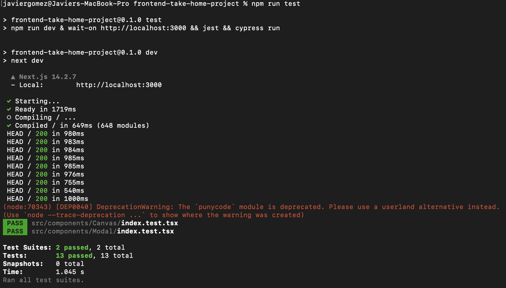
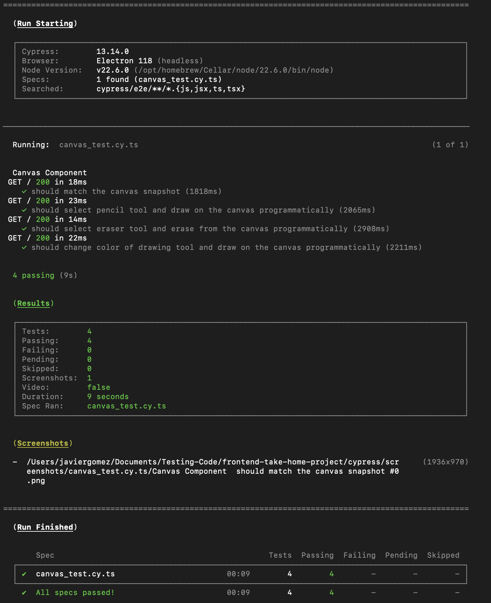

# Classkick Front End Engineering Take Home Project

## Intro
Welcome! and thank you for taking the time to complete the Classkick take-home challenge for our Senior/Staff Frontend Engineer position.

You will have a week to complete the project and expect to spend < 5 hours on it. Once you have completed your solution, please reply with a link to a forked GitHub repository or your folder with any helpful instructions for us.
If there's anything that you did not successfully complete, please add notes to your README section about what you could have done and reasoning behind the choices you made

## Motivation
At Classkick, our teachers and students LOVE using our [Canvas](https://developer.mozilla.org/en-US/docs/Web/API/Canvas_API/Tutorial) feature to create fun and engaging content.

This project emulates the type of scenarios we face at Classkick, with similar technical challenges regarding UI and real-time UX.

## Goal
Your task is to create a [Canvas](https://developer.mozilla.org/en-US/docs/Web/API/Canvas_API/Tutorial) element to:
- Create a `Drawing`
- Create a `Textbox`
- Add an `Eraser Tool`. The Eraser UX is left up to your design decisions. Here are 3 examples of how it could function, but you can design your own function as well.
    - The eraser acts like a smudge eraser.
    - When a user smudges over a line in eraser mode, that erases the entire line.
    - When a user points and clicks a line, it erases.

**[Bonus]**: Add other tools like Colors, Images, or something else!

## Requirements:
 - Exhibits SOLID design principles, good application architecture, and project organization.
 - Create components as you feel is best suited for your solution and feel free to use any libraries and explain why you chose those libraries
 - Your app does NOT have to be hooked up to a backend and thus it does NOT have to preserve state. If you do choose to persist state, or even integrate with a backend, it will be considred a bonus. However, you should still stub out the API calls that you would make to persist state.
 - It should be clear in your code and/or documentation on areas for eg:
    - Design/Technical decisions
    - Mocks/stubs a virtual API that could be injected to persist all actions on the canvas remotely (eg: Firebase)
 - Tests!

Just remember: when in doubt, treat this project as though you are about to submit it to your peers for a PR.

## Bonus:
- Make it accessible.
- Make it production ready.
- Stand up a backend in order to persist state.

## Styling Guidelines

## Mocks

## Setup Guide
[SETUP GUIDE](SETUP.md)

Good luck and if you have questions, please reach out to us at hiring@classkick.com

# TEST COMPLETED

# Summary

## 1. Imports Explanation

### 1.1 Icons from `react-icons/fa`

I use these icons to easily integrate and manage UI elements like drawing, erasing, and file actions, providing a consistent and visually appealing interface.

### 1.2 `axios`

I use `axios` for making HTTP requests to fetch data, such as retrieving flags. It provides a straightforward API for handling responses and errors.

## 2. Component Import vs. Inline Creation

### `import Modal from '../Modal'`

I import the `Modal` component from a separate file because:
- **It helps keep code organized and modular.**
- **It allows me to reuse components across the application.**
- **It simplifies maintenance and testing.**

## 3. Testing Tools Choice

### Cypress and Jest

- **Cypress**: I use it for end-to-end testing to simulate user interactions and check overall application functionality.
- **Jest**: I use it for unit testing to ensure individual components and functions work correctly in isolation.

#### Results

## 4. Script Explanations

- **`dev`**: Runs `next dev` to start the Next.js development server. This is used for local development.

- **`build`**: Runs `next build` to create an optimized production build of the application.

- **`start`**: Runs `next start` to start the Next.js production server after building the application.

- **`lint`**: Runs `next lint` to check the code for linting issues and enforce coding standards.

- **`test`**: Runs the development server (`npm run dev`), waits for it to be available on `http://localhost:3000`, then runs unit tests with Jest (`jest`) and end-to-end tests with Cypress (`cypress run`).

- **`jest`**: Runs unit tests using Jest to check the functionality of individual components and functions.

- **`cypress:open`**: Opens the Cypress Test Runner in interactive mode, allowing for manual testing and debugging of end-to-end tests.

- **`cypress:run`**: Runs Cypress tests in headless mode, typically used for automated testing in CI/CD pipelines.

## 5. Clarification

- I created a test to validate if flag selection was working. The test works correctly but generated a warning indicating that a Canvas update within a test was not included in `act(...)`. 

- I attempted several ways and methods to resolve this warning but could not fix it. 

- I will try to resolve it with more time and patience. 

- The code for this test is commented out (in the file `index.test.tsx`) to prevent it from generating the warning while running other tests.

